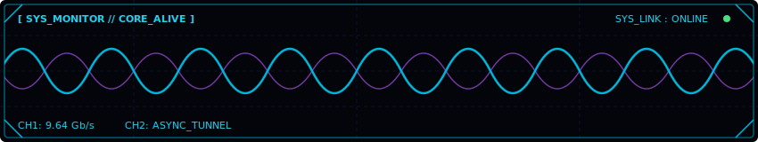

<!-- Hey, Nice to see you here. Don't worry it's all vibe coded. -->

  

  

<h1 align="center">Nonsense Shin</h1>

  <code> Security Researcher</code> • <code>Bug Bounty Hunter</code> • <code>Malware Developer</code>

  
  
  

<blockquote>
  

    <i>"Have I not commanded you? Be strong and courageous. Do not be afraid; do not be discouraged, for the Lord your God will be with you wherever you go."</i> 
    <b>— Joshua 1:9</b>
  

</blockquote>

  
<b>Want to know me</b>

   
  

    
I am a cybersecurity specialist, offensive security researcher, and AI integration engineer focused on building resilient systems and adaptable solutions across modern IT environments with strong interest in AI-driven security and emerging technologies.

    <ul>
      <li><b>Independent Research:</b> Active as an Ethical Hacker and Bug Bounty Hunter, identified vulnerabilites accross 300+ organizations.</li>
      <li><b>Malware Analysis & Development:</b> Engineering custom simulation scripts and researching forensic tracking evasion capabilities maintaining controlled payload testing in adversary 
simulations strictly for ethical hacking purposes to proactively stop cybercrime from spreading.</li>
      <li><b>AI Integration Engineering:</b> Designing secure, decoupled runtime architectures utilizing asynchronous backends to safely bridge artificial intelligence engines with custom interface control arrays.</li>
    </ul>
  

---

### ⚡ Operational Core Matrix

  
  
  
  

 

### 🗃️ Active Weapons & Intelligence Arrays

Browse the clean, refactored nodes of my security environments:

<table>
  <tr>
    <td width="50%" valign="top">
      <a href="https://github.com/Friendly-user0/Huntn">
        <h4>🛰️ HUNTn Framework</h4>
      </a>
      
Attack surface Intelligence mapping tool. Orchestrates 8 execution stages from Passive OSINT to Vulnerability Scanning.

    </td>
    <td width="50%" valign="top">
      <a href="https://github.com/Friendly-user0/Malware-Development">
        <h4>🧬 Malware Development</h4>
      </a>
      
Diving into malware analytics, offensive mechanics, forensic tracking evasion, and custom utility scripts written in C.

    </td>
  </tr>
  <tr>
    <td width="50%" valign="top">
      <a href="https://github.com/Friendly-user0/Scripting-and-Automation">
        <h4>🛠️ Scripting & Automation</h4>
      </a>
      
Tool suites, fuzzing utilities, endpoint rotation components, and the historical shell assets.

    </td>
    <td width="50%" valign="top">
      <a href="https://github.com/Friendly-user0/Resources">
        <h4>📚 Security Resources</h4>
      </a>
      
Central intelligence repository containing deep web hacking notes alongside compiled HTB and THM lab walkthroughs.

    </td>
  </tr>
  <tr>
    <td colspan="2" width="100%" valign="top">
      <a href="https://github.com/Friendly-user0/Artificial-Intelligence-Operations">
        <h4>🤖 Artificial Intelligence Operations (AI-Ops)</h4>
      </a>
      
An asynchronous custom terminal interface environment powered by FastAPI and integrated with the Google Gemini 2.5 Flash engine. Simulates a tactical operational command console with dynamic system instructions and automated asynchronous payload handling.

    </td>
  </tr>
</table>

---

### 📡 Mainframe Core Telemetry Stream

  <!-- LOCAL HIGH-SPEED CYBER OPTIC ARRAY ASSET -->
  

  <b><i>"John 8:32"</i></b>

